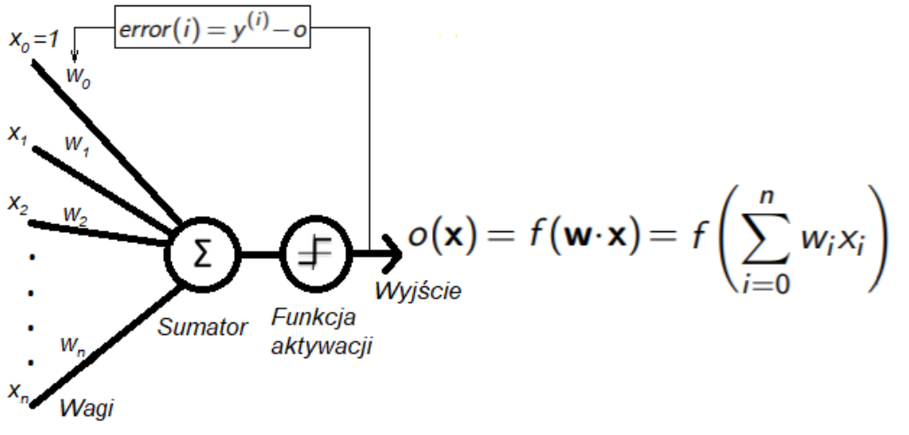
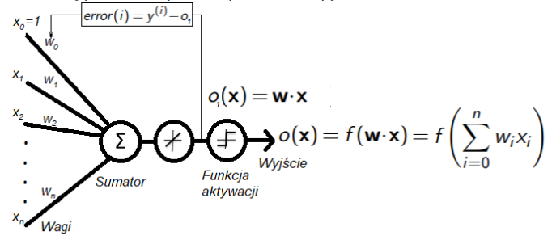

## Perceptron oraz Adaline
1. Opis problemu
Zadaniem była implementacja perceptronu i nauczenie go poprawnej klasyfikacji gatunków irysów, dla zbioru danych Iris.data. Neuron należało zaimplementować petodą perceptronu oraz Adaline, a następnie porównać klasyfikowanie na podstawie dwóch i trzech klas.
2. Przebeg zadania
   1. Perceptron 
         $\\$ 
         
         $\\$ 
         Dla zbioru 
         $Z = {(x^(1),y^(1)),...,(x^(N),y^(N))}$  $\\$ 
         od ustalonej liczby nepoch nalezy iterować po zbiorze Z  $\\$ 
         dla i=1,...,N nalezy obliczyć wagi,  $\\$ 
         $error(i)=y^(i)-o(x^(i))$ $\\$ $\Delta w = \eta * error(i)*x^(i)$  
         $\\$ 
         $w=w+\Delta w$
         $\\$ $\eta$ to współczynnik uczenia z przedziału (0,1). Zbiór Z to 80% danych z każdej klasy. Zbiór testowy to pozostałe 20%, na tym zbiorze testowany jest perceptron.
   2. Adaline
         $\\$ 
         
         $\\$ 
         Dla zbioru 
         $Z = {(x^(1),y^(1)),...,(x^(N),y^(N))}$  
         $\\$ 
         od ustalonej liczby nepoch nalezy iterować po zbiorze Z  
         $\\$ 
         dla i=1,...,N nalezy obliczyć wagi,  
         $\\$ 
         $error(i)=y^(i)-o_1(x^(i))$ $\\$ $\Delta w = \eta * error(i)*x^(i)$  
         $\\$ 
         $w=w+\Delta w$
         $\\$ 
         $\eta$ to współczynnik uczenia z przedziału (0,1). Zbiór Z to 80% danych z każdej klasy. Zbiór testowy to pozostałe 20%, na tym zbiorze testowany jest Adaline.
         
        