## Perceptron oraz Adaline
1. Opis problemu
Zadaniem była implementacja perceptronu i nauczenie go poprawnej klasyfikacji gatunków irysów, dla zbioru danych Iris.data. Neuron należało zaimplementować petodą perceptronu oraz Adaline, a następnie porównać klasyfikowanie na podstawie dwóch i trzech klas.
2. Przebeg zadania
   1. Perceptron 
         $\\$ 
         
         $\\$ 
         Dla zbioru 
         $Z = {(x^(1),y^(1)),...,(x^(N),y^(N))}$  $\\$ 
         od ustalonej liczby nepoch nalezy iterować po zbiorze Z  $\\$ 
         dla i=1,...,N nalezy obliczyć wagi,  $\\$ 
         $error(i)=y^(i)-o(x^(i))$ $\\$ $\Delta w = \eta * error(i)*x^(i)$  
         $\\$ 
         $w=w+\Delta w$
         $\\$ $\eta$ to współczynnik uczenia z przedziału (0,1). Zbiór Z to 80% danych z każdej klasy. Zbiór testowy to pozostałe 20%, na tym zbiorze testowany jest perceptron.
   2. Adaline
         $\\$ 
         
         $\\$ 
         Dla zbioru 
         $Z = {(x^(1),y^(1)),...,(x^(N),y^(N))}$  
         $\\$ 
         od ustalonej liczby nepoch nalezy iterować po zbiorze Z  
         $\\$ 
         dla i=1,...,N nalezy obliczyć wagi,  
         $\\$ 
         $error(i)=y^(i)-o_1(x^(i))$ $\\$ $\Delta w = \eta * error(i)*x^(i)$  
         $\\$ 
         $w=w+\Delta w$
         $\\$ 
         $\eta$ to współczynnik uczenia z przedziału (0,1). Zbiór Z to 80% danych z każdej klasy. Zbiór testowy to pozostałe 20%, na tym zbiorze testowany jest Adaline.
         
3. Wyniki:
   1. Perceptron, 2 klasy $\\$
   Trening na długościach: $\\$
   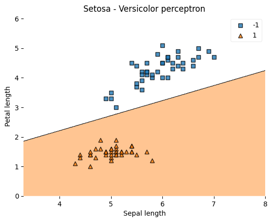    $\\$
   Trening na szerokościach: $\\$
   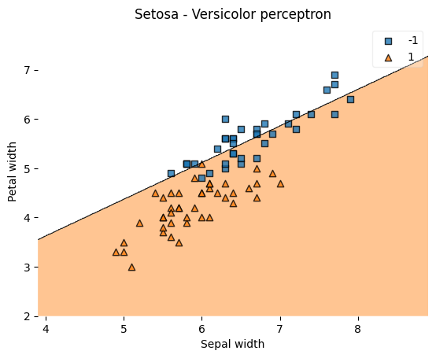$\\$
   Test na długościach: $\\$
   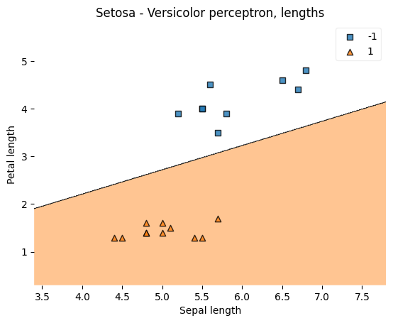$\\$
   Test na szerokościach: $\\$
   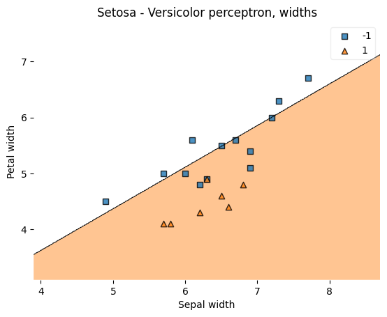$\\$
   2. Adaline,  2 klasy $\\$
   Trening na długościach: $\\$
   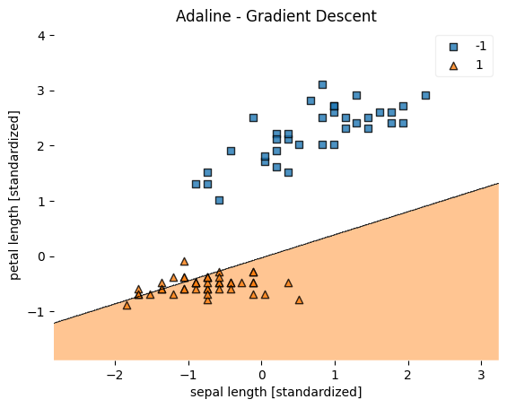    $\\$
   Trening na szerokościach: $\\$
   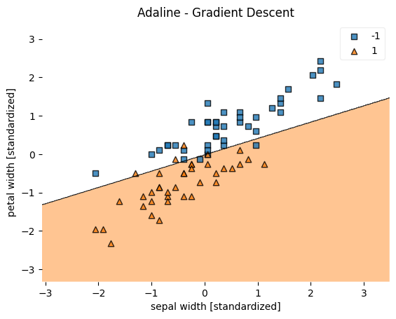$\\$
   Test na długościach: $\\$
   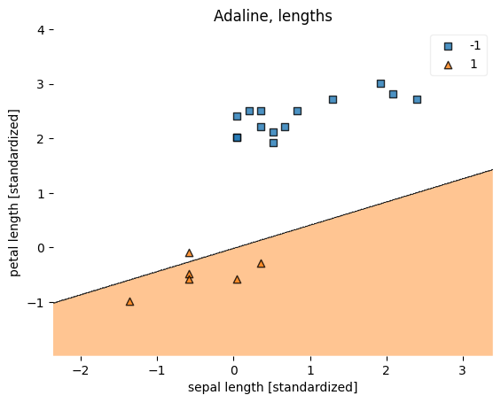$\\$
   Test na szerokościach: $\\$
   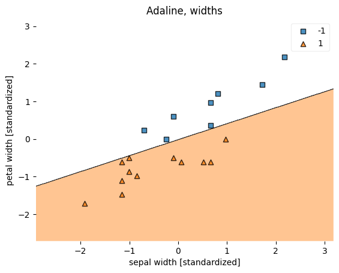$\\$
   3. Perceptron, 3 klasy $\\$
   Liczba błędnych klasyfikacji: $\\$
   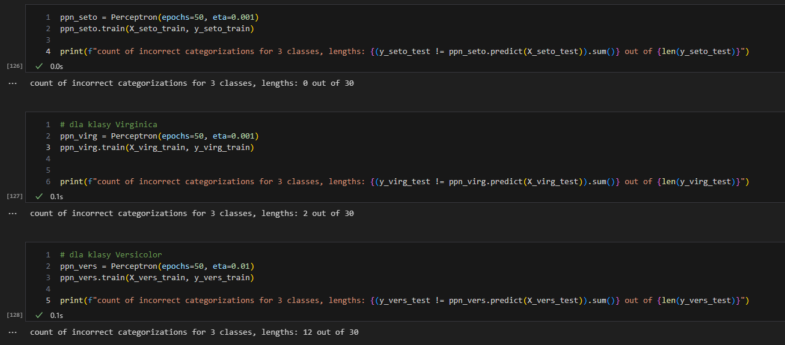    $\\$
   4. Adaline, 3 klasy $\\$
   Liczba błędnych klasyfikacji: $\\$
   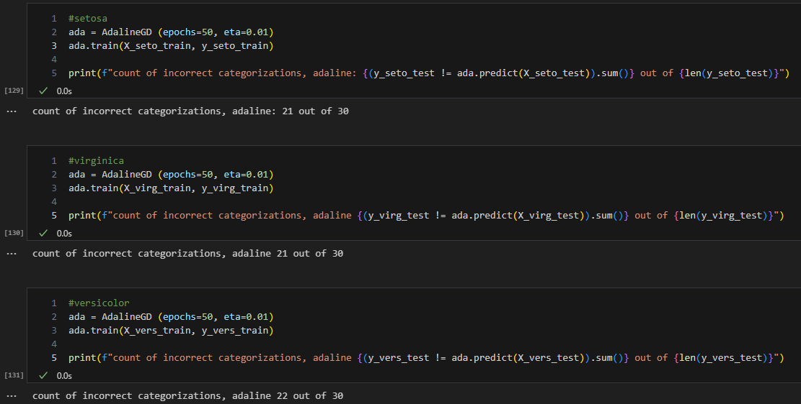    $\\$
   5. Różne kombinacje, perceptron. $\\$
   Wpierw $\eta = 0.01$, nastepnie $\eta = 0.5$  $\\$
   W kolejności setosa, virginica, versicolor $\\$
   Liczba błędnych klasyfikacji: $\\$
   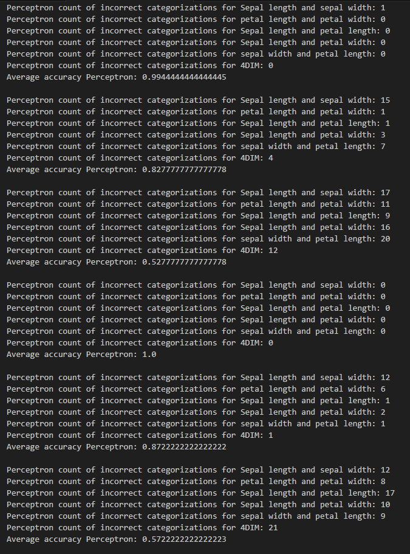    $\\$
   6. Różne kombinacje, Adaline $\\$
   Wpierw $\eta = 0.01$, nastepnie $\eta = 0.5$  $\\$
   W kolejności setosa, virginica, versicolor $\\$
   Liczba błędnych klasyfikacji: $\\$
   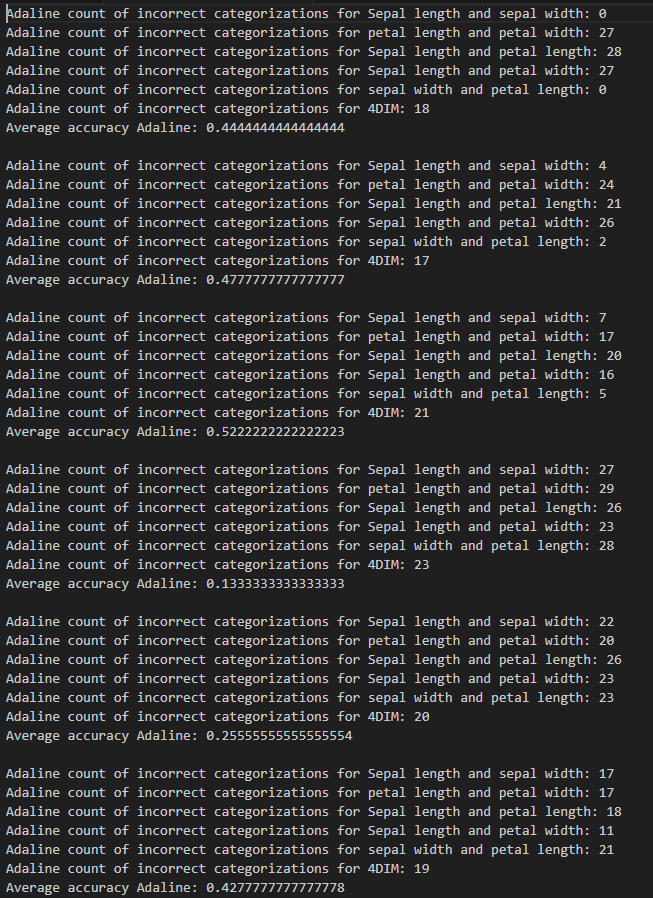    $\\$
4. Wnioski:
   - współczynnik uczenia nie ma większego wpływu na klasyfikację trzech klas metodą perceptronu.
   - Adaline sprawdza się lepiej przy dwóch klasach
   - Perceptron sprawdza się lepiej przy trzech klasach