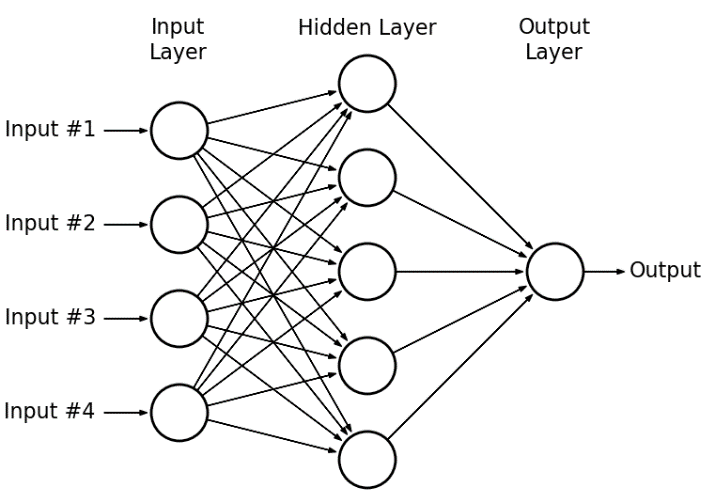
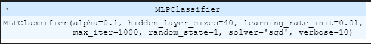
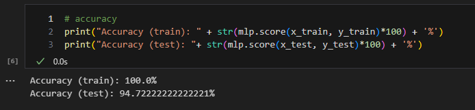
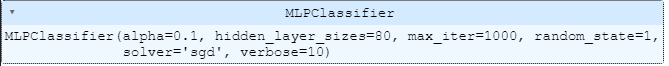
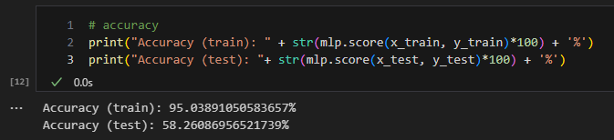

## Klasyfikacja wieloklasowa
1. Opis problemu
   Zadaniem było przeprowadzenie klasyfikacji wieloklasowej przy pomocy wielowarstwowego perceptronu. Przeprowadzono to na trzech zestawach danych: Iris, liczb pisanych odręcznie (MNIST) oraz datasetu jakości win. Należało również uruchomić funkcję softmax na wyjściu sieci dla klasyfikacji wieloklasowej, a następnie dobrać parametry dla neuronu za pomoć funkcji GridSearchCV, szukającej hiper-parametrów.
2. Perceptron wielowarstwowy
   
   Wejściem perceptronu jest wektor 28 * 28, z kodowaniem liter $\\$
   Warstwy ukryte - to jedna z funkcji aktywacji $\\$
   Na wyjściu zastosowana funkcja softmax.
   $\\$
   Funkcja softmax: $\\$
    $\\$
3. Wyniki:
   1. Iris: $\\$
      Parametry: $\\$
       $\\$
      Skuteczność: $\\$
       $\\$
      Macierz pomyłek: $\\$
      $\\$
   2. MNIST: $\\$
      Parametry: $\\$
       $\\$
      Skuteczność: $\\$
       $\\$
      Macierz pomyłek: $\\$
      $\\$
   3. Jakość win: $\\$
      Parametry: $\\$
       $\\$
      Skuteczność: $\\$
       $\\$
      Macierz pomyłek: $\\$
      $\\$
4. Wnioski
   - Perceptron wielowarstwowy wykazał się doskonałą zdolnością przewidywania zbioru danych Iris. Jego dokładność była prawie 100% dla zbioru treningowego i osiągnęła 100% dla zbioru testowego. Ten zbiór danych, ze względu na swoją złożoność, był najłatwiejszy do nauczenia się.
   - W przypadku zbioru danych MNIST, perceptron wielowarstwowy radził sobie również bardzo dobrze, uzyskując wynik 100% na zbiorze treningowym, a skuteczność na zbiorze testowym wyniosła 94,72%, co jest satysfakcjonującym rezultatem. Jednak czas nauki na tym zbiorze danych był znacznie dłuższy niż w przypadku zbioru danych Iris.
   - Dla zbioru danych z kaggle, skuteczność wyniosła 54%. Jest to skomplikowany zbiór danych, na którym obliczenia trwają bardzo długo.