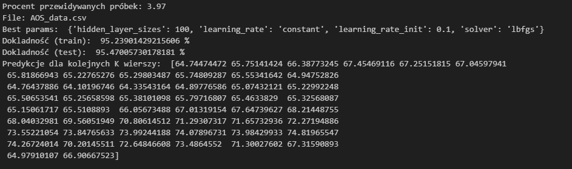

## Regresja
1. Opis problemu
$\\$
Celem zadania było zaimplementowanie wielowarstwowego perceptronu neuronowego i sprawdzenie jego skuteczności na przykładach historycznych danych giełdowych. Należało również zbadać, jaki odsetek próbek możemy przewidzieć w przyszłości, aby utrzymać błąd na poziomie 5% błędu względnego.
$\\$
W ramach zadania należało zaimplementować neuron wielowarstwowy za pomocą metody perceptronu wielowarstwowego. Następnie, używając funkcji GridSearchCV, należało nauczyć neuron poprzez dobór optymalnych hiperparametrów.
$\\$
2. Wyniki:$\\$
     $\\$
    Wykres porównujący prognozę z rzeczywistością: $\\$
     $\\$
3. Wnioski:
- predykcja dla danych giełdowych generuje zadowalające wyniki przy dłuższym czasie